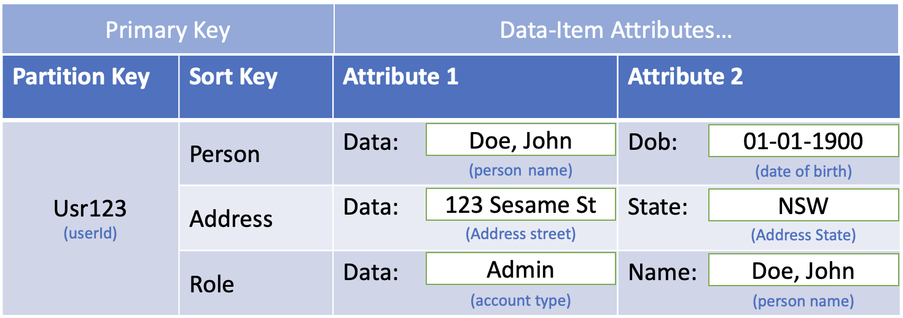
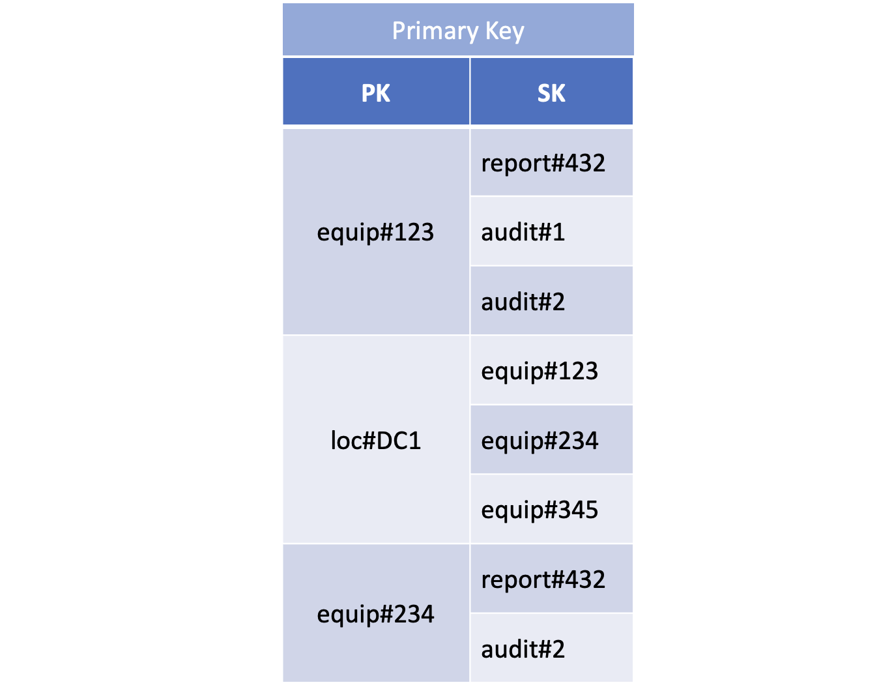
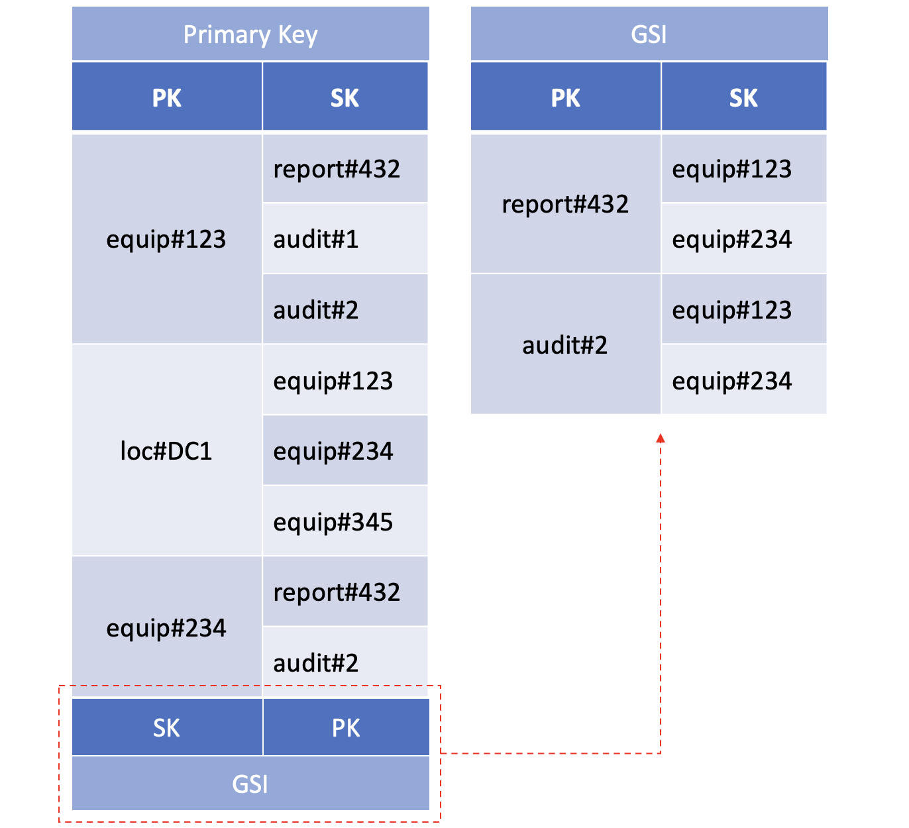
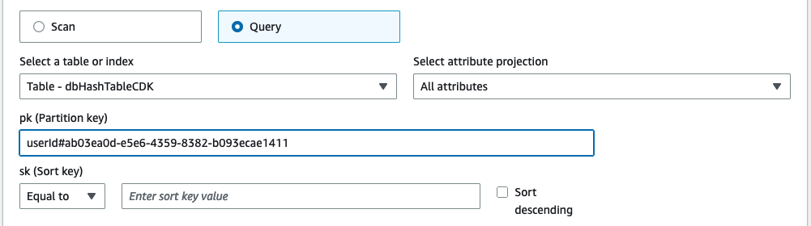
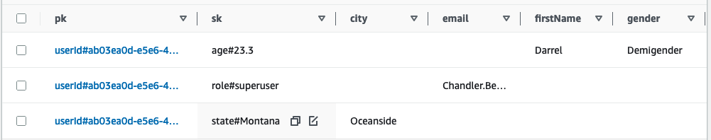
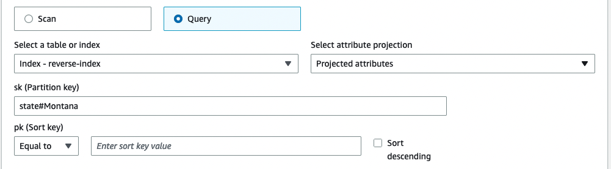
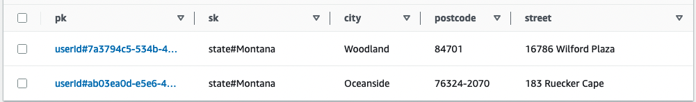

# DynamoDB Hash Sort Overloading
This CDK Demo builds a DynamoDB Table with Composite key (PK-SK) and GSI reverse-index (SK-PK), using range key overloading, partition key prefixing and reverse-GSI overloading to support relational data structures in a single table.

---

## Core Components of DynamoDB

In DynamoDB, tables, items, and attributes are the core components that you work with. A table is a collection of items, and each item is a collection of attributes. DynamoDB uses primary keys to uniquely identify each item in a table and secondary indexes to provide more querying flexibility.

The following video will give you an introductory look at tables, items, and attributes: [Tables, items, and attributes](https://www.youtube.com/embed/Mw8wCj0gkRc)

Read more about DynamoDB Core components in the[Amazon DynamoDB Developer Guide](https://docs.aws.amazon.com/amazondynamodb/latest/developerguide/HowItWorks.CoreComponents.html).

---

## DynamoDB NoSQL design

NoSQL design requires a different mindset than Relational database systems (RDBMS) design. For an RDBMS, a normalized data model can be created without thinking about access patterns, which can be extended later when new query requirements arise. Each type of data is organized into its own table.

By contrast, a DynamoDB schema shouldn't be designed until all queires it will need to fulfill are known. Understanding the business problems and the application use cases up front is essential. 

Keep related data together. Instead of distributing related data items across multiple tables, you should keep related items in your NoSQL system as close together as possible.

> Remember: Maintain as few tables as possible in a DynamoDB application. Having fewer tables maintains scalablity, requires less permissions management, and reduces overhead for your DynamoDB application.

In order to design a DynamoDB relational data schema, there are a few simple things to know:

### Primary Keys
The primary key uniquely identifies each item in a table, so that no two items can have the same key.

Each primary key attribute must be a scalar (meaning that it can hold only a single value). The only data types allowed for primary key attributes are string, number, or binary. There are no such restrictions for other, non-key attributes.

In DynamoDB there are two different kinds of primary keys:

- **Partition key** – A simple primary key, composed of one attribute known as the partition key. The partition key of an item is also known as its hash attribute. 

- **Composite Key** - This type of key is composed of two attributes, The first attribute is the partition key, and the second attribute is the sort key. The sort key of an item is also known as its range attribute. 

DynamoDB uses the partition key value as input to an internal hash function. The output from the hash function determines the partition (physical storage internal to DynamoDB) in which the item will be stored. All items with the same partition key value are stored together. In a composite key, items stored together are in sorted order by sort key value.

> Remember: In a table that has a partition key and a sort key, it's possible for multiple items to have the same partition key value. However, those items must have different sort key values.

### Secondary indexes
A secondary index lets you query the data in the table using an alternate key, in addition to queries against the primary key. '

In DynamoDB there are two different kinds of secondary indexes:

- **Local secondary index** – An index that has the same partition key as the table, but a different sort key.

- **Global secondary index** – An index with a partition key and sort key that can be different from those on the table.

When you create an index, you specify which attributes will be copied, or projected, from the base table to the index. At a minimum, DynamoDB projects the key attributes from the base table into the index.

### Relational Data Modelling
In DynamoDB, one way to achieve relational data modeling is by using composite sort keys and  overloaded global secondary indexes. You can use these elements to structure the data so that an application can retrieve whatever it needs for a given access pattern using a single query on a table or index. 

**Global Secondary Index Overloading**

While DynamoDB has a default 20 global secondary indexes (GSI) per table, it is possible to index across far more than 20 data fields. A table in DynamoDB can hold many different kinds of data items at one time. In addition, the same attribute in different items can contain entirely different kinds of information.

As an example, this DynamoDB table demonstrates the use of a variety of different kinds of data stored in the *Data* attribute (Attribute 1).



Depending on its parent item, the *Data* attribute, which is common to all the items, has different content. A GSI for the table that uses the table's sort key as its partition key and the *Data* attribute as its sort key, can support a variety of different queries using that single GSI. This is known as GSI overloading.

this is just one pattern for secondary indexes to improve query efficiency. To further details on other patterns read the [Best practices for using secondary indexes in DynamoDB](https://docs.aws.amazon.com/amazondynamodb/latest/developerguide/bp-indexes.html) in the Amazon DynamoDB Developer Guide.

**Hash Sort (Composite Key) Overloading**
- Partition Key Prefixing - To store multiple types of entities (data) in a single table, the primary key needs a way to distinctly identify each entity. Using prefixes to distinguish between entity types can prevent collisions and assist in querying. For example, both customers and employees can be stored in the same table, the primary key for a customer could be `CUSTOMER#[CUSTOMERID]`, and the primary key for an employee could be `EMPLOYEE#[EMPLOYEEID]`.

- Sort Key Overloading - In the same way that the sort key of a GSI can be overloaded, the Sort Key of the Primary Key can be overloaded to hold different types of data which can be used to sort the partition. 

Together the Partition Key and the Sort Key making up the Composite Key can be queried in specific ways.

The Partition Key, can only do equals (=), meaning that the Partition Key must be known for a given query. Read further on [Querying and Scaning](https://docs.aws.amazon.com/amazondynamodb/latest/developerguide/bp-query-scan.html).

However the the query operators available to the Sort Key for standard sorting are: **eq** (=), **gt** (>), **lt** (<), **le** (<=), **ge** (>=), as well as **between** and **begins_with**, making it possible to also prefix the Sort Key so it can be used to define hierarchical data, that can be queried at any level of the hierarchy, or alternatively group data by prefix.

Defining hierarchical data for example, in a table listing geographical locations, the Sort Key can be structured to segment each of hierachical levels.

```js
[country]#[region]#[state]#[county]#[city]#[neighborhood]
```
allowing efficient range queries for a list of locations at any one of these levels of aggregation, from `country`, to a `neighborhood`, and everything in between.

or the alternate for grouping data for example, in a table listing many relational entities, the Sort key can be structured to group and sort across relational entities.



Where the Partition key groups all records with the same Key into the one index, the prefixed sort key is structured to both group and sort on the prefix, allowing to store multiple entity types across a single relational partition key.

Using generic keys `PK` & `SK` to facilitate heterogeneous partitions and relational references as prefixes in the Sort Key, this pattern by itself is known as Partition Overloading, 

However, Partition Overloading coupled with a Reverse Index GSI, where the Table Sort Key (SK) is used as the GSI Partition Key, and the Table Partition Key (PK) is used as the GSI Sort Key, allowing the capability to conduct reverse queries where the Table Sort Key is known and using the GSI to sort by the Table Partition Key results in a parant relational query.



As a result of the Table Partition Key being prefixed, the GSI Sort Key is prefixed, therefore making a GSI Overloading Pattern, with Reverse Index GSI and Partition Overloading, all together forms the pattern **Hash Sort Overloading**

--- 
---

## Building a DynamoDB Hash Sort Overloading Schema

At its most basic the DynamoDB schema is very simple, the Primary key is a Composite Key with the Partition Key name of `pk` and a type of `STRING`, and the Sort Key name of `sk` and a type of `STRING` 

```TypeScript
const table = new dyndb.Table(this, "dbHashSortTable", {
    tableName: "dbHashTable",
    partitionKey: { name: "pk", type: dyndb.AttributeType.STRING},
    sortKey: { name: "sk", type: dyndb.AttributeType.STRING},
    removalPolicy: cdk.RemovalPolicy.DESTROY
})
```
Together the `pk` and `sk` being of type `STRING` allows for **Partition Key Prefixing** and **Sort Key Overloading**.

Additionally create and add a Global Secondary Index (GSI) as a **Revese Index** of the Table Index, where the GSI Partition Key is the Table Sort Key `sk`, and the GSI Sort Key is the Table Partition Key `pk`. 

```TypeScript
const globalSecondaryIndexProps: dyndb.GlobalSecondaryIndexProps = {
    indexName: 'reverse-index',
    partitionKey: {
    name: 'sk',
    type: dyndb.AttributeType.STRING,
    },
    sortKey: {
    name: 'pk',
    type: dyndb.AttributeType.STRING,
    }
};

table.addGlobalSecondaryIndex(globalSecondaryIndexProps);
```
### Populate Table with Test Data

As there is no Data Schema on a DynamoDB struction, with the Primary Key set as a Composite Key of `pk` & `sk`. The only Attributes that must be provided for an Item are `pk` and `sk`, all other attributes for the item are optional.

In order to create a relational structure, and populate with test data, create a series of interfaces to represnt the schema of the Table data from the application perspective.

```TypeScript
interface IPerson {
  pk: { S: string };
  sk: { S: string };//age
  firstName: { S: string };
  lastName: { S: string };
  gender: { S: string };
}

interface IAddress {
  pk: { S: string };
  sk: { S: string };//state
  city: { S: string };
  street: { S: string };
  postcode: { S: string }; 
}

interface IAccount {
  pk: { S: string };
  sk: { S: string };//role
  username: { S: string };
  password: { S: string };
  email: { S: string };
}
```
In this examples each of the attributes is of type string, event the sort key for age, as it will be prefixed with a sort string.

using the faker-JS library (safe version ^7.5) crate a function for each entity interface to generate a random value for each attribute

```TypeScript
private generatePersonItem = (): IPerson => {
    return {
      pk: { S: `userId#${faker.datatype.uuid()}` },
      sk: { S: `age#${faker.datatype.number({ max: 50, min: 18, precision: 0.1 })}`},
      firstName: { S: faker.name.firstName() },
      lastName: { S: faker.name.lastName() },
      gender: { S: faker.name.gender() },
    };
};
```

In order to generate a batch of entities (so as not to just insert one of each entity), create a function to iterate and create an array of entities with the PK for each iteration of the array as the relationship between entities.

```TypeScript
private generateBatch = (batchSize = 25): { 
    Person: { PutRequest: { Item: IPerson } }[], 
    Address: { PutRequest: { Item: IAddress } }[],
    Account: { PutRequest: { Item: IAccount } }[] 
  } => {
    let arr = new Array(batchSize).fill(undefined).map(() => {
      return { PutRequest: { Item: this.generatePersonItem() } }
    });
    return {
      Person: arr,
      Address: arr.map((el) => {return {PutRequest: { Item: this.generateAddressItem(el.PutRequest.Item.pk.S)}}}),
      Account: arr.map((el) => {return {PutRequest: { Item: this.generateAccountItem(el.PutRequest.Item.pk.S)}}})
    }
  };
```

Finally we call the generate batch function to create the array of entities, and use a CDK AWS Custom Resource to batch write the items to the DynamoDB table once the Table deployment and GSI creation is complete.

```TypeScript
let batch = this.generateBatch();
new cr.AwsCustomResource(this, `initDBPersonBatch`, {
    onCreate: {
    service: 'DynamoDB',
    action: 'batchWriteItem',
    parameters: {
        RequestItems: {
        [table.tableName]: batch.Person
        },
    },
    physicalResourceId: cr.PhysicalResourceId.of(`initDBDataBatch1`),
    },
    policy: cr.AwsCustomResourcePolicy.fromSdkCalls({ resources: [table.tableArn] }),
});
```

### Deploy 

* `npm run build`   compile typescript to js
* `cdk deploy`      deploy the stack to your default AWS account/region

### Test

Once the Table is deployed and populated with data, you can then run a query for all records of a specfic user:




and search for all users of a specific record type but cunducting a query on the reverse-index:




## Clean Up
* `cdk destroy`     roll back and remove the CDK app stack.

The removal policy on the CDK DynamoDB table is Destroy, so running the destroy command will allow the DynamoDB to be deleted, even though it is populated with data.